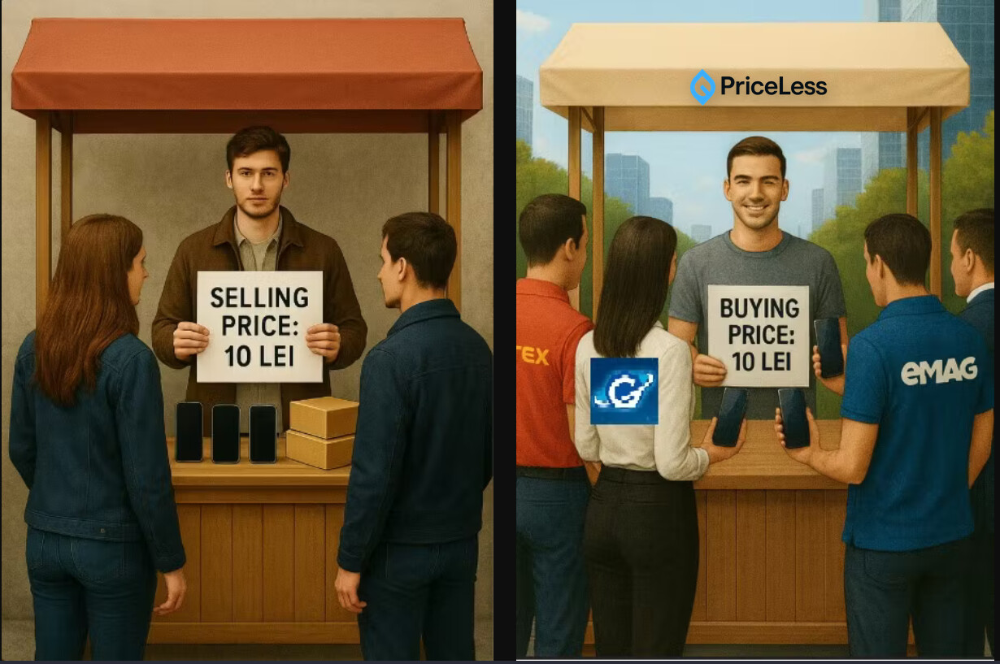
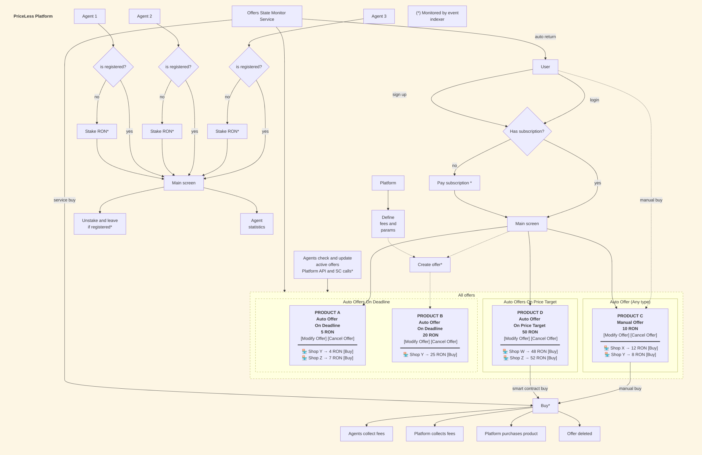

# PriceLess
 
  

 PriceLess is a decentralized price-fulfillment platform where users set their desired price for any product sold online, and third-party agents compete to find the best available deals from online stores. Agents earn fees when they successfully fulfill offers, creating a competitive marketplace that drives prices down for users.

## Flowchart

